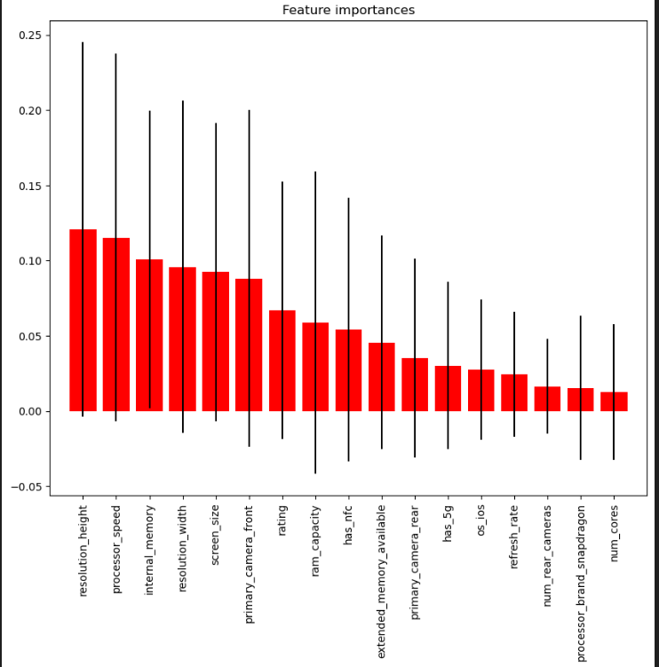

# Smartphone-Dataset-Analysis

We have taken a Smartphones dataset which consists of 210 rows and 26 different columns . The columns includes Brand Name , model , price , rating , has_5g, has_nfc etc and
Row consists of different 210 phones with models and brands. We will perform analysis and prediction model.

# Data Analysis

We have analyzed that the following 17 attributes are important for the price prediction in this dataset:
1. resolution_height
2. processor_speed
3. screen_size
4. internal_memory
5. resolution_width
6. primary_camera_front
7. rating
8. ram_capacity
9. has_nfc
10. extended_memory_available
11. primary_camera_rear
12. os_ios
13. refresh_rate
14. has_5g
15. num_rear_cameras
16. num_cores
17. processor_brand_snapdragon


# Custom Models
## Custom Random Forest Regression Model
First lets take a look at the `CustomDecisionTreeRegressor` and `CustomRandomForestRegressor` classes step by step to understand how they work.

### `CustomDecisionTreeRegressor`

#### `__init__` method:
- Initializes the class with `max_depth` which limits the depth of the tree.
- `self.tree` will hold the structure of the decision tree once it's built.

```python
def __init__(self, max_depth=None):
    self.max_depth = max_depth
    self.tree = None
```

#### `fit` method:
- Takes input data `X` and target `y` to build the decision tree.
- Calls the `_build_tree` method starting from depth 0.

```python
def fit(self, X, y):
    self.tree = self._build_tree(X, y, depth=0)
```

#### `predict` method:
- Takes input data `X` and predicts the target values by traversing the built tree for each input sample.
- Uses the `_predict_tree` method for each sample.

```python
def predict(self, X):
    return np.array([self._predict_tree(x, self.tree) for x in X])
```

#### `_build_tree` method:
- Recursively builds the decision tree.
- If the maximum depth is reached or the target values are all the same, it returns the mean of the target values.
- Otherwise, it chooses the feature with the highest variance to split the data.
- It then recursively builds the left and right subtrees.

```python
def _build_tree(self, X, y, depth):
    if depth == self.max_depth or len(np.unique(y)) == 1:
        return np.mean(y)
    feature_idx = np.argmax(np.var(X, axis=0))
    split_value = np.mean(X[:, feature_idx])
    left_mask = X[:, feature_idx] < split_value
    X_left, y_left = X[left_mask], y[left_mask]
    X_right, y_right = X[~left_mask], y[~left_mask]
    left_tree = self._build_tree(X_left, y_left, depth + 1)
    right_tree = self._build_tree(X_right, y_right, depth + 1)
    return {'feature_idx': feature_idx,
            'split_value': split_value,
            'left_tree': left_tree,
            'right_tree': right_tree}
```

#### `_predict_tree` method:
- Recursively traverses the tree to make a prediction for a given sample.
- If the node is a leaf (i.e., a mean value), it returns the value.
- Otherwise, it checks the feature value and goes to the left or right subtree based on the split value.

```python
def _predict_tree(self, x, tree):
    if isinstance(tree, (float, np.float64)):
        return tree
    if x[tree['feature_idx']] < tree['split_value']:
        return self._predict_tree(x, tree['left_tree'])
    else:
        return self._predict_tree(x, tree['right_tree'])
```

### `CustomRandomForestRegressor`

#### `__init__` method:
- Initializes the class with `n_estimators` (number of trees) and `max_depth`.
- `self.estimators` will hold the individual decision trees.

```python
def __init__(self, n_estimators=100, max_depth=None):
    self.n_estimators = n_estimators
    self.max_depth = max_depth
    self.estimators = []
```

#### `fit` method:
- Takes input data `X` and target `y`.
- Converts `X` and `y` to NumPy arrays if they are pandas DataFrames or Series.
- For each estimator, it creates a bootstrap sample (random sample with replacement) from `X` and `y`, trains a decision tree on this sample, and adds the tree to the list of estimators.

```python
def fit(self, X, y):
    self.estimators = []
    X_np = X.values if isinstance(X, pd.DataFrame) else X
    y_np = y.values if isinstance(y, pd.Series) else y
    for _ in range(self.n_estimators):
        idx = np.random.choice(len(X_np), size=len(X_np), replace=True)
        X_bootstrapped = X_np[idx]
        y_bootstrapped = y_np[idx]
        tree = CustomDecisionTreeRegressor(max_depth=self.max_depth)
        tree.fit(X_bootstrapped, y_bootstrapped)
        self.estimators.append(tree)
```

#### `predict` method:
- Takes input data `X`.
- Converts `X` to a NumPy array if it is a pandas DataFrame.
- Predicts the target values for each sample by averaging the predictions from all the individual decision trees.

```python
def predict(self, X):
    X_np = X.values if isinstance(X, pd.DataFrame) else X
    predictions = np.zeros(len(X_np))
    for tree in self.estimators:
        predictions += tree.predict(X_np)
    return predictions / self.n_estimators
```

### `apply_custom_random_forest` function

This function demonstrates how to use the `CustomRandomForestRegressor`:

1. **Data Preparation**: Splits the data into training and testing sets.
2. **Model Training**: Initializes and trains the custom random forest regressor.
3. **Prediction and Evaluation**: Predicts on the test set and computes evaluation metrics (MSE, MAE, R²).
4. **Model Saving**: Saves the trained model to a file using `pickle`.

```python
def apply_custom_random_forest(X, y):
    from sklearn.metrics import mean_squared_error, mean_absolute_error, r2_score
    from sklearn.model_selection import train_test_split
    import pickle

    X_train, X_test, y_train, y_test = train_test_split(X, y, test_size=0.2, random_state=42)
    
    model = CustomRandomForestRegressor(n_estimators=100, max_depth=5)
    model.fit(X_train, y_train)
    y_pred = model.predict(X_test)
    
    mse = mean_squared_error(y_test, y_pred)
    mae = mean_absolute_error(y_test, y_pred)
    r2 = r2_score(y_test, y_pred)
    
    print(f'Mean Squared Error : {mse}\nMean Absolute Error : {mae}\nR2 Score : {r2}')

    with open('models/custom_random_forest.pb', 'wb') as hd:
        pickle.dump(model, hd)

    return y_pred
```

This comprehensive explanation covers the implementation and functionality of both the `CustomDecisionTreeRegressor` and `CustomRandomForestRegressor` classes, as well as how to apply and evaluate the custom random forest model on a dataset.

## Custom Linear Regression Model
Let's break down the `CustomLinearRegression` class and the `use_custom_linear_regression` function to understand their functionality.

### `CustomLinearRegression` Class

#### `__init__` method
- Initializes the linear regression model.
- `self.coef_` and `self.intercept_` will hold the coefficients and intercept of the fitted model.
- `self._fit_intercept` is a boolean that indicates whether to fit the intercept term or not.

```python
class CustomLinearRegression:
    def __init__(self, fit_intercept=True):
        self.coef_ = None
        self.intercept_ = None
        self._fit_intercept = fit_intercept
```

#### `__repr__` method
- Provides a string representation of the object.

```python
def __repr__(self):
    return "I am a Linear Regression model!"
```

#### `fit` method
- Fits the linear regression model to the data `X` and `y`.
- If `X` is 1D, it reshapes it to a 2D array.
- Computes the degrees of freedom for the total and error variance.
- If `fit_intercept` is `True`, it adds a column of ones to `X` to account for the intercept.
- Uses the closed-form solution (Normal Equation) to compute the coefficients.
- Calculates the fitted values and residuals.

```python
def fit(self, X, y):
    if len(X.shape) == 1:
        X = X.reshape(-1,1)
    
    self.features_ = X
    self.target_ = y
    
    self.dft_ = X.shape[0] - 1
    self.dfe_ = X.shape[0] - X.shape[1] - 1
    
    if self._fit_intercept:
        X_biased = np.c_[np.ones(X.shape[0]), X]
    else:
        X_biased = X
    
    xTx = np.dot(X_biased.T, X_biased)
    inverse_xTx = np.linalg.inv(xTx)
    xTy = np.dot(X_biased.T, y)
    coef = np.dot(inverse_xTx, xTy)
    
    if self._fit_intercept:
        self.intercept_ = coef[0]
        self.coef_ = coef[1:]
    else:
        self.intercept_ = 0
        self.coef_ = coef
    
    self.fitted_ = np.dot(X, self.coef_) + self.intercept_
    self.resid_ = self.target_ - self.fitted_
```

#### `predict` method
- Predicts the target values for the input data `X`.
- If `X` is 1D, it reshapes it to a 2D array.
- Uses the fitted coefficients and intercept to compute the predictions.

```python
def predict(self, X):
    if len(X.shape) == 1:
        X = X.reshape(-1,1)
    self.predicted_ = self.intercept_ + np.dot(X, self.coef_)
    return self.predicted_
```

### `use_custom_linear_regression` Function

This function demonstrates how to use the `CustomLinearRegression` class:

1. **Model Initialization**: Initializes the custom linear regression model.
2. **Model Training**: Fits the model to the training data `X_train` and `y_train`.
3. **Prediction**: Uses the fitted model to predict the target values for the test data `X_test`.
4. **Model Saving**: Saves the trained model to a file using `pickle`.

```python
def use_custom_linear_regression(X_train, y_train, X_test):
    lr = CustomLinearRegression()
    lr.fit(X_train, y_train)
    y_pred = lr.predict(X_test)
    with open('models/custom_linear_regression.pb', 'wb') as hd:
        pickle.dump(lr, hd)
    return y_pred
```

### Summary

- **Initialization**: `CustomLinearRegression` initializes with or without an intercept.
- **Fitting**: The `fit` method calculates the coefficients using the Normal Equation, accounting for an intercept if needed.
- **Prediction**: The `predict` method uses the calculated coefficients to predict target values for new data.
- **Model Usage**: `use_custom_linear_regression` shows how to train the model on training data, make predictions on test data, and save the model.


# Model Analysis

Until now we have trained several models and calculated their r2_scores on this dataset. Here we will list the models and their r2 scores:

1. LinearRegression (r2_score = 0.6574685071128396)
2. RandomForestRegressor (r2_score = 0.7479186726265188)
3. RandomizedSearchCV(using RandomForestRegressor) (r2_score = 0.8542147632441565)
4. CustomLinearRegressor (r2_score = 0.6574685071128386)
5. Custom RandomForestRegressor (r2_score = 0.7460475272596003)


Thus, we can infer that using RandomForestRegressor with RandomizedSearchCV works best on this dataset.
